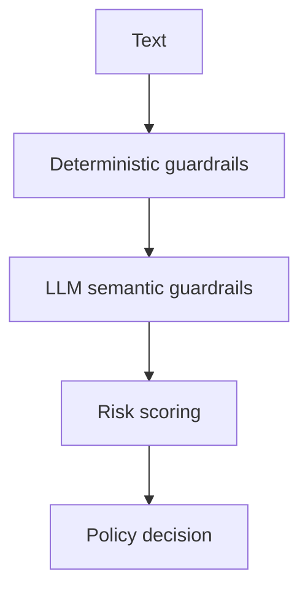

# LLM Guardrails

This folder contains semantic guardrails that sit on top of the deterministic framework.

## Purpose

Deterministic guardrails catch known patterns quickly. LLM guardrails classify intent and context that may not match exact keywords or regular expressions, such as indirect prompt injection, subtle bias, contextual toxicity, and unsupported claims.

## Files

- `semantic.py` defines `LLMGuardrail` and reusable semantic strategies for toxicity, prompt injection, jailbreaks, hallucination, unsafe responses, moderation, and bias.
- `__init__.py` exports the public semantic guardrail classes.

## Flow

## Extension Points

Subclass `LLMGuardrail`, set `name`, `category`, `stage`, and `rubric`, then register the guardrail with `GuardrailEngine.add_guardrail()`.
